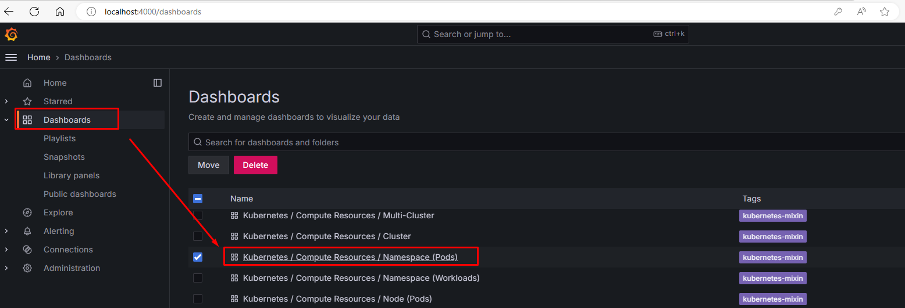
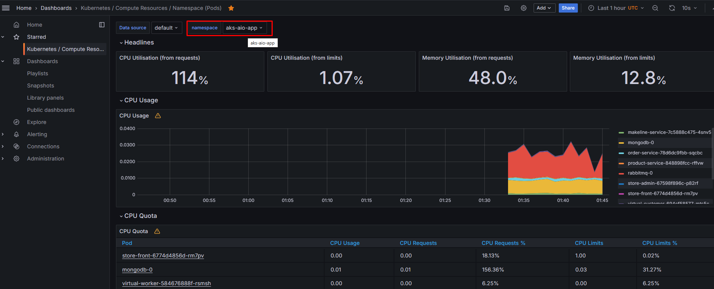

# Project: Provisioning AKS Cluster using Terraform

## 1-Provision a fresh AKS cluster

### Prerequisite

An Azure account with an active subscription

### Authenticate to Azure

```bash
az login
az account show

# Replace the email by your Microsoft account email (as shown in the above command)
email="replace_by_your_email"
subscription_id=$(az account list --query "[?user.name=='$email'].{Name:name, ID:id, Default:isDefault}" | jq -r '.[].ID')
echo $subscription_id
az account set --subscription $subscription_id
```

### Create a service principal

```bash
chmod +x specify-service-cred.sh

# Run the scipt with you service name and subscription ID
## your_subscription_id: input your target Subscription ID
## your_service_principal_name: input your target Service Principal Name
./specify-service-cred.sh "your_subscription_id "your_service_principal_name"
```

### Deploy cluster

### Initialize Terraform

```bash
terraform init
```

### Terraform plan

```bash
terraform plan -out main.tfplan
```

### Terraform apply

```bash
terraform apply main.tfplan
```

### Check the result

- Verify if your AKS cluster is up and running!
- NOTE: Do not commit the `./private_k8s_config/azurek8s` file
- I've already added the `private_k8s_config` folder to the .gitignore. But just for sure!

```bash
# Check cluster
resource_group_name=$(terraform output -raw resource_group_name)
az aks list --resource-group $resource_group_name --query "[].{\"K8s cluster name\":name}" --output table

# Save config to local
mkdir private_k8s_config
echo "$(terraform output kube_config)" > ./private_k8s_config/azurek8s

# Streamline your k8s config
./streamline_k8s_config.sh ./private_k8s_config/azurek8s
```

- Accessing your cluster

```bash
export KUBECONFIG=./private_k8s_config/azurek8s
kubectl get nodes
kubectl top nodes
```

- You now can see the output like this, congratulations!

```bash
➜  terraform-aks-cluster git:(issue-86) ✗ export KUBECONFIG=./private_k8s_config/azurek8s
➜  terraform-aks-cluster git:(issue-86) ✗ kubectl get nodes
NAME                                STATUS   ROLES   AGE   VERSION
aks-agentpool-28459652-vmss000000   Ready    agent   12m   v1.27.9
aks-agentpool-28459652-vmss000001   Ready    agent   11m   v1.27.9
➜  terraform-aks-cluster git:(issue-86) ✗ kubectl top nodes
NAME                                CPU(cores)   CPU%   MEMORY(bytes)   MEMORY%
aks-agentpool-28459652-vmss000000   118m         6%     1346Mi          29%
aks-agentpool-28459652-vmss000001   166m         8%     998Mi           21%
➜  terraform-aks-cluster git:(issue-86) ✗
```

## 2-Deploy the sample application on AKS cluster

### Deploy with kubectl

Using sample app from https://github.com/Azure-Samples/aks-store-demo/blob/main/aks-store-all-in-one.yaml

```bash
kubectl create ns aks-aio-app
kubectl apply -f https://raw.githubusercontent.com/Azure-Samples/aks-store-demo/main/aks-store-all-in-one.yaml -n aks-aio-app
```

### Check deployment

Get all resource of `aks-aio-app` namespace

```bash
kubectl get all -n aks-aio-app
```

### Check service

```bash
➜  terraform-aks-cluster git:(issue-88-deploy) ✗ kubectl get service -n aks-aio-app
NAME               TYPE           CLUSTER-IP     EXTERNAL-IP     PORT(S)              AGE
makeline-service   ClusterIP      10.0.214.49    <none>          3001/TCP             2m2s
mongodb            ClusterIP      10.0.62.53     <none>          27017/TCP            2m7s
order-service      ClusterIP      10.0.43.255    <none>          3000/TCP             2m4s
product-service    ClusterIP      10.0.189.194   <none>          3002/TCP             2m1s
rabbitmq           ClusterIP      10.0.150.103   <none>          5672/TCP,15672/TCP   2m5s
store-admin        LoadBalancer   10.0.73.148    xx.yy.zz.aa     80:32072/TCP         118s
store-front        LoadBalancer   10.0.9.95      xx.yy.zz.ff     80:31199/TCP         119s
```

### Access to the app

- Use the <EXTERNAL-IP> of store-front to access the frontend page
  
- Use the <EXTERNAL-IP> of store-admin to access the admin page
  

## 3-Monitor the App with Prometheus and Grafana

### Prerequesite

- Helm

### Deploy Prometheus/Grafana stack

```bash
# Prepare
kubectl create ns monitoring
helm repo add prometheus-community https://prometheus-community.github.io/helm-charts
helm repo update
# Deploy
helm install kube-prometheus-stack prometheus-community/kube-prometheus-stack --namespace monitoring
```

### Check deployment resource

- Check the deployment resources

```bash
# Pod checking
kubectl --namespace monitoring get pods -l "release=kube-prometheus-stack"
# All resources checking
kubectl --namespace monitoring get all
```

- Check service

```bash
➜  terraform-aks-cluster kubectl --namespace monitoring get svc

NAME                                             TYPE        CLUSTER-IP     EXTERNAL-IP   PORT(S)                      AGE
alertmanager-operated                            ClusterIP   None           <none>        9093/TCP,9094/TCP,9094/UDP   3m12s
kube-prometheus-stack-alertmanager               ClusterIP   10.0.130.140   <none>        9093/TCP,8080/TCP            3m18s
kube-prometheus-stack-grafana                    ClusterIP   10.0.223.108   <none>        80/TCP                       3m18s
kube-prometheus-stack-kube-state-metrics         ClusterIP   10.0.190.136   <none>        8080/TCP                     3m18s
kube-prometheus-stack-operator                   ClusterIP   10.0.153.232   <none>        443/TCP                      3m18s
kube-prometheus-stack-prometheus                 ClusterIP   10.0.22.103    <none>        9090/TCP,8080/TCP            3m18s
kube-prometheus-stack-prometheus-node-exporter   ClusterIP   10.0.146.164   <none>        9100/TCP                     3m18s
prometheus-operated                              ClusterIP   None           <none>        9090/TCP                     3m12s
```

### Access the dashboard

- Expose Grafana

```bash
kubectl port-forward svc/kube-prometheus-stack-grafana -n monitoring 4000:80
```

- Expose Prometheus

```bash
kubectl port-forward svc/kube-prometheus-stack-prometheus -n monitoring 4001:9090
```

Now we can login to http://localhost:4000 (The default username/password for Grafana is `admin/prom-operator`)

### Explore the dashboard

- Choosing the dashboard
  

- View resource monitoring
  

## 4-Delete AKS resources

Once done with the demo, we can cleanup resouce to save the cost

```bash
terraform plan -destroy -out main.destroy.tfplan
terraform apply main.destroy.tfplan
# Remove the k8s config
rm private_k8s_config
```
